# OncoLake — Snowflake Clinical Research Data Platform

A HIPAA-aware, Snowflake-native data platform built on **fully synthetic** oncology data. It ingests clinical data through multiple paths (Matillion ELT, Snowpipe auto-ingest, and semi-structured JSON), extracts structured fields from free-text clinical notes with an LLM, models the result into governed dimensional marts with dbt (including an SCD Type 2 patient dimension), and surfaces cohort metrics in a Streamlit-in-Snowflake app.

> **No PHI, ever.** Every record is synthetically generated. The project mirrors how a cancer-center data team moves clinical data through a pipeline — de-identify, ingest, extract, validate, model, serve — without touching any real patient information.

The project was built to mirror the architecture Moffitt Cancer Center published in *Enabling Precision Medicine in Cancer Care Through a Molecular Data Warehouse* (JCO Clin Cancer Inform, 2021): many heterogeneous sources into a governed warehouse, out to a cohort data mart, and into a cohort explorer for researchers. OncoLake applies that same **engineering shape** to synthetic clinical data — it does not reproduce their genomic/molecular side. See [`docs/moffitt_alignment.md`](docs/moffitt_alignment.md).

---

## What problem does this solve?

Cancer centers document visits, pathology reports, and tumor board discussions as free-text clinical notes. To support cancer-registry reporting, cohort research, and outcomes tracking, that text has to become structured, queryable data. OncoLake automates that path end to end: it takes messy, multi-format synthetic oncology data, mines the clinical notes for key fields (cancer stage, primary site, treatment), models it into a governed warehouse, and turns it into a searchable cohort explorer — built with the exact stack in the Moffitt Data Engineer job description.

---

## Architecture

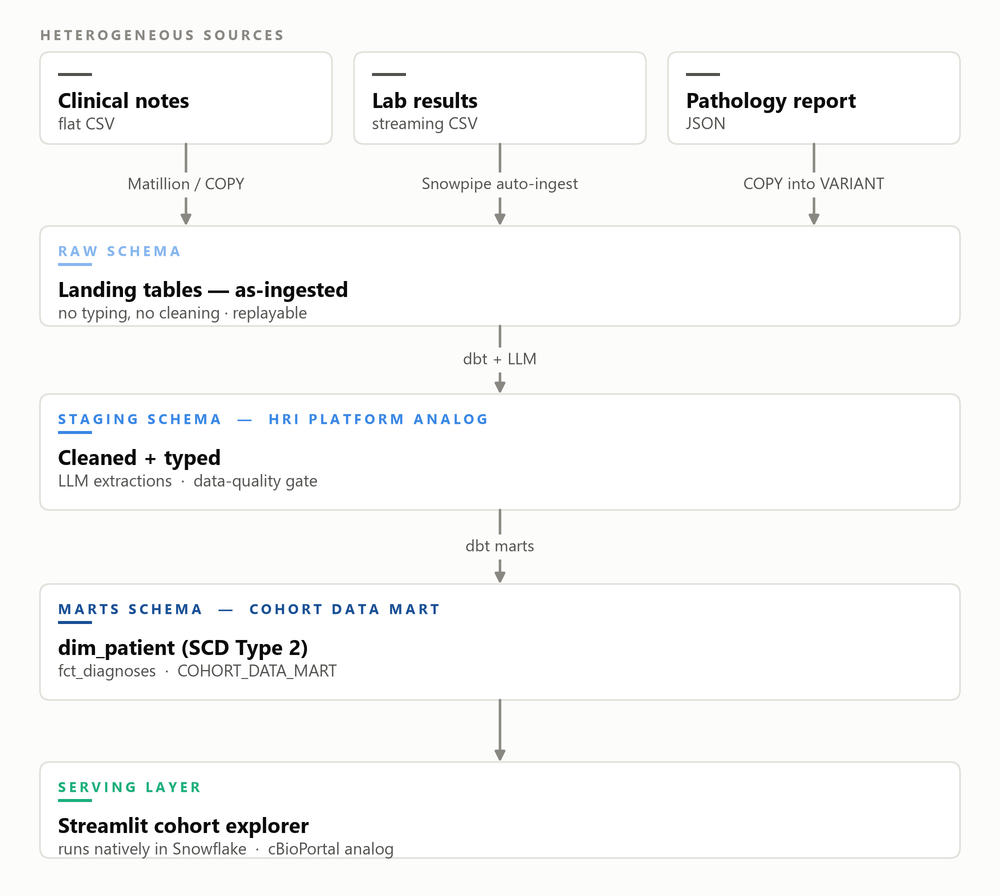

<details>
<summary>Diagram source (Mermaid)</summary>

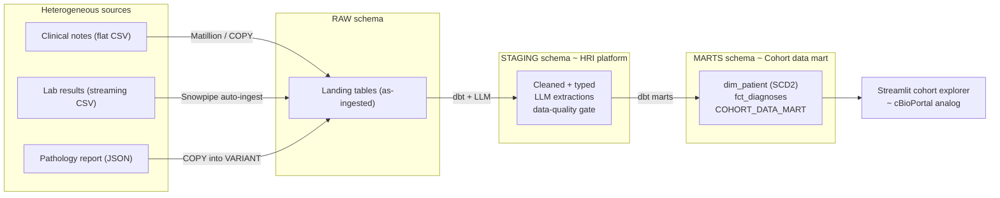

</details>

**Layer mapping:** `RAW` (as-ingested sources) → `STAGING` (cleaned, governed — the HRI-warehouse analog) → `MARTS` (the cohort data mart) → the Streamlit explorer (the cBioPortal analog). Built entirely on synthetic data in a Snowflake AWS `us-east-2` account.

---

## Tech stack

| Layer | Tools |
|---|---|
| Warehouse | Snowflake (RAW / STAGING / MARTS schemas, virtual warehouses, micro-partitions, Streams & Tasks) |
| Ingestion | Matillion Data Productivity Cloud (ELT), Snowpipe auto-ingest, COPY INTO, JSON/VARIANT |
| Event pipeline | AWS S3, SQS, Lambda, Secrets Manager, IAM storage integration |
| LLM extraction | Anthropic Claude API (structured JSON output) — Snowflake Cortex version included for paid accounts |
| Transformation & modeling | dbt (staging views, dimensional marts, SCD Type 2 snapshot, tests, seeds) |
| Serving | Streamlit-in-Snowflake (native cohort explorer) |
| Language / tooling | Python 3.11, SnowSQL, Git, GitHub Actions CI |

---

## Pipeline walkthrough

### 1. Multi-source ingestion

Three source types land in `RAW`, satisfying the JD's requirement to ingest JDBC/flat-file/JSON/streaming formats: flat-file clinical notes, semi-structured JSON pathology reports (landed in a VARIANT column then flattened), and streaming lab-result CSVs.

**Two ingestion paths into the same table.** Lab results arrive both through **Snowpipe** (event-driven) and through **Matillion** (orchestrated). The screenshot below shows both in `RAW_LAB_RESULTS`: Matillion-loaded rows carry a populated `_FILE` and `_LOADED_AT`, while Snowpipe rows show `null` for those metadata columns — the fingerprint of each path, in one table.

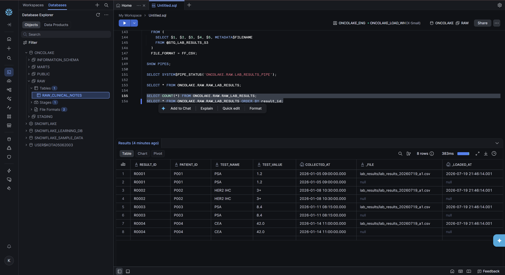

**Snowpipe auto-ingest** fires on an S3 object-create event routed through SQS. The pipe status confirms the full chain worked end to end (`executionState: RUNNING`, `lastIngestedFilePath: lab_results_20260719_a1.csv`, `lastReceivedMessageTimestamp` present):

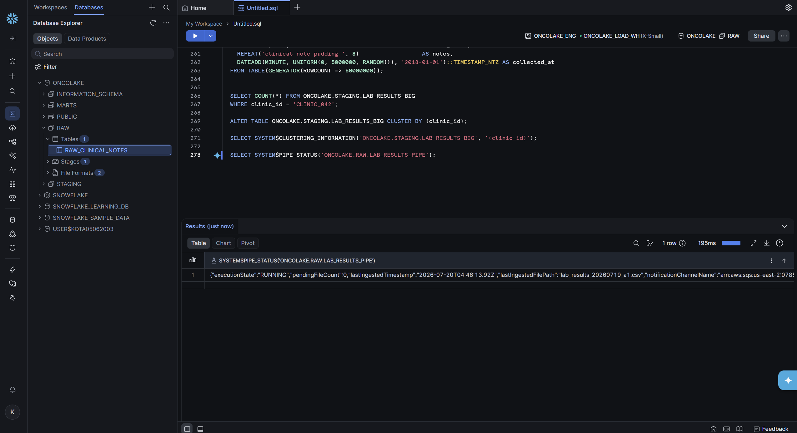

### 2. Matillion ELT (orchestration + transformation)

An **orchestration** pipeline loads from S3 and then chains into a **transformation** pipeline — one end-to-end run does everything. Matillion authenticates to AWS via cloud credentials and to Snowflake via the project connection; the JDBC source credential is read from AWS Secrets Manager rather than hardcoded.

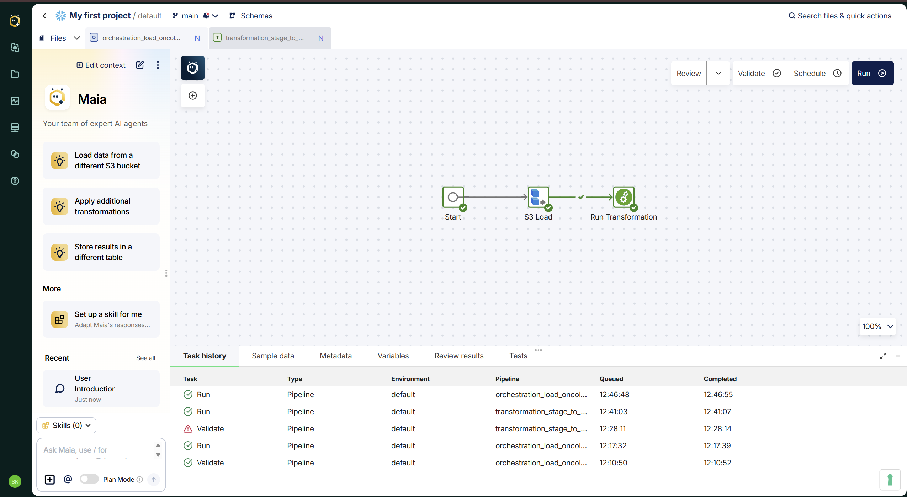

The transformation job reads the landing table, casts `collected_at` from text to `TIMESTAMP_NTZ`, and writes a curated table — demonstrating the ELT pushdown model (transformation happens inside Snowflake).

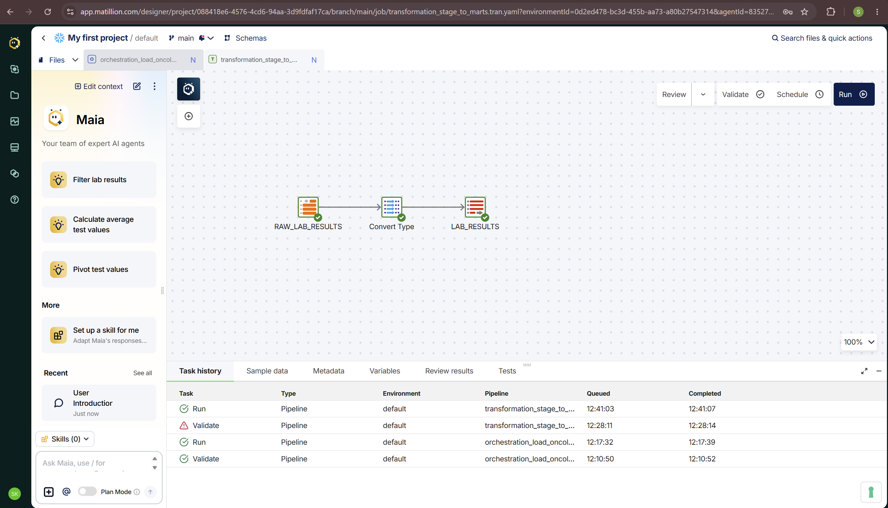

### 3. LLM extraction from clinical notes

An LLM reads each free-text clinical note and returns structured JSON — primary site, histology, TNM/AJCC stage, treatments, biomarkers. On the synthetic set the extraction matched the gold labels on all fields (stage, site, treatment), mirroring the 0.908 micro-F1 result from a related external Claude-API clinical-notes pipeline.

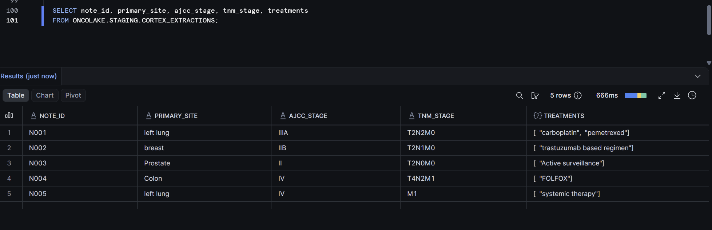

### 4. dbt marts + SCD Type 2

dbt builds staging views and dimensional marts, including an **SCD Type 2 patient dimension** (a dbt snapshot) and a wide `COHORT_DATA_MART` that the explorer reads. The mart joins the ICD-O-3 topography crosswalk (e.g. `left lung → C34.9`). Note patient `P001` appearing twice — captured at stage IIIA in January and again at stage IV in March — which is the SCD2 history preserving the patient's progression over time.

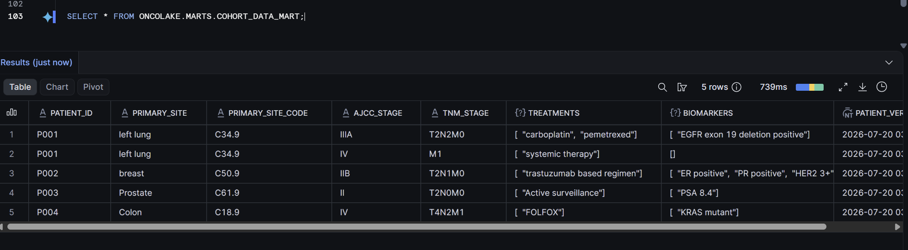

dbt data-quality tests (not-null keys, unique diagnosis id, and an `accepted_values` check that every AJCC stage is valid) all pass — the clinical data-quality discipline the JD calls out.

### 5. Streamlit cohort explorer

A Streamlit-in-Snowflake app reads `COHORT_DATA_MART` and lets a researcher filter a cohort by AJCC stage and see patient counts, treatment breakdown, and a data-quality panel (100% fill rates on primary site and stage). No external hosting — it runs natively inside Snowflake.

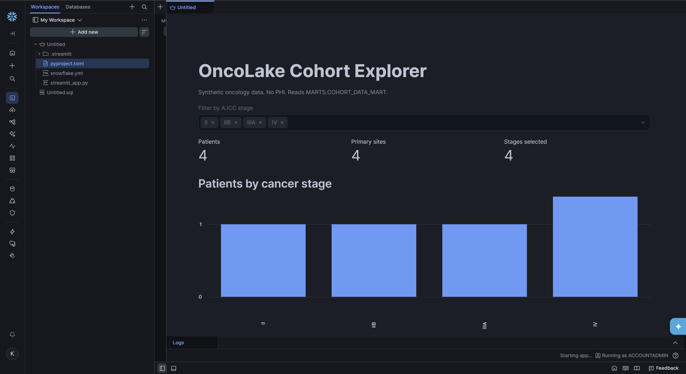

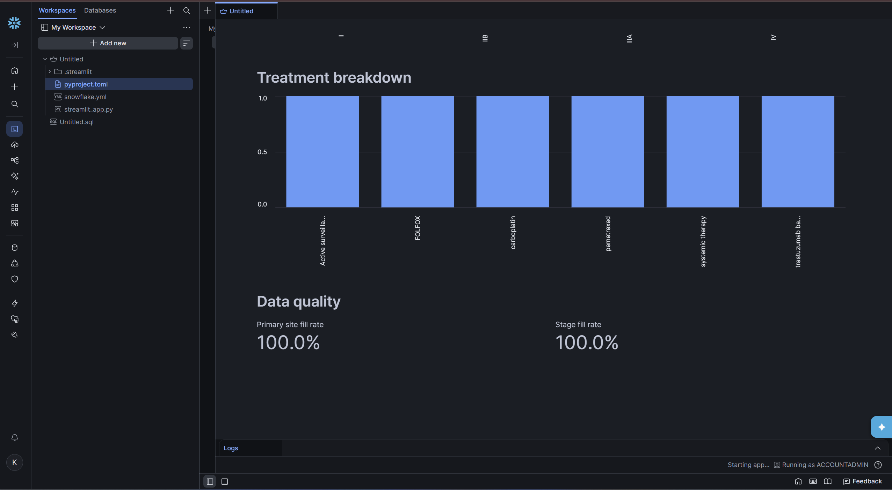

### 6. Query profiling & performance tuning

To exercise performance tuning, a 40M-row synthetic table was generated and profiled. The Query Profile below shows a full-scan baseline (16/16 partitions scanned, 143.56 MB) for a leading-wildcard `ILIKE '%psa%'` predicate.

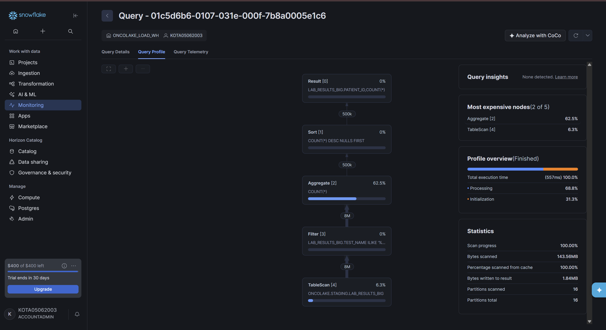

The tuning experiment produced a genuinely useful finding — see below.

---

## Engineering decisions and problems solved

Real builds hit real constraints. Here is how each was handled.

**Snowflake Cortex is blocked on trial accounts.** The design called for running the LLM extraction natively in-warehouse with `SNOWFLAKE.CORTEX.COMPLETE()`. Trial accounts return "AI function is not available for trial accounts," and there is no Cortex-only tier. Rather than convert to a paid account mid-build, I kept the extraction LLM-based via the **Claude API** (which produces the same structured JSON into the same `STAGING.CORTEX_EXTRACTIONS` table, so every downstream model was unchanged) and kept the Cortex-native SQL in the repo as the production path. The honest framing: the extraction logic is LLM-based via the Claude API; the repo includes the Cortex version for a paid Snowflake environment.

**S3 cannot route one event to two destinations with overlapping filters.** Snowpipe already owned the `s3://…/lab_results/` object-create event via its SQS queue. Adding a validation Lambda on the same prefix failed with *"Configuration is ambiguously defined… overlapping suffixes."* The production-correct answer is to fan out a single S3 event through **SNS** to both the SQS queue and the Lambda. For the demo I separated concerns by prefix and validated the Lambda directly via a test event (accept + reject paths), and documented the SNS fan-out as the productionization step — knowing *why* the overlap happens and how to resolve it properly.

**The IAM storage-integration handshake.** Wiring Snowpipe to S3 required the two-way trust handshake: create the storage integration, read `STORAGE_AWS_IAM_USER_ARN` and `STORAGE_AWS_EXTERNAL_ID` from `DESC INTEGRATION`, and paste them back into the IAM role's trust policy. This is the step that silently breaks most Snowpipe setups (files land in S3 but the table stays empty). It was validated cleanly with `LIST @stage` before building the pipe.

**Clustering is a judgment call, not a default.** I set out to show "clustering made the query faster" and instead learned when clustering does *not* help — a stronger result. On a low-cardinality key (`test_name`, 5 values) nothing could be pruned. On a very high-cardinality key (`patient_key`, millions of values; and a formatted string `clinic_id`) Snowflake explicitly warned about expensive reclustering. And measuring immediately after `ALTER … CLUSTER BY` captures reclustering churn, not steady-state. The takeaway recorded in [`snowflake/tuning/before_after.md`](snowflake/tuning/before_after.md): clustering only pays off with a *medium-cardinality* key on a table large enough to span many partitions; otherwise the equality-predicate rewrite (`= 'PSA'` over `ILIKE '%psa%'`) is the cheaper, more reliable win.

**Two ingestion patterns on purpose.** Building both Snowpipe (event-driven) and Matillion (orchestrated) ingestion into the same table demonstrates both patterns and their tradeoffs — push-based low-latency vs. scheduled control-flow — and produced the dual-ingestion artifact above.

**Semi-structured handling.** JSON pathology reports are landed raw in a VARIANT column and flattened in a second step, rather than typed on ingest — the standard "land raw, model later" discipline for lineage and replayability.

---

## Results

- **LLM extraction:** structured stage / site / treatment extracted from every synthetic note, matching gold labels (mirrors 0.908 micro-F1 from the related external pipeline).
- **dbt:** staging + marts built, including an SCD Type 2 patient dimension; **5 data-quality tests pass** (not-null, unique, accepted AJCC stages).
- **Ingestion:** Snowpipe auto-ingest and Matillion ELT both load into Snowflake; end-to-end Matillion pipeline chained (S3 Load → Run Transformation).
- **Serving:** live Streamlit-in-Snowflake cohort explorer with a data-quality panel (100% fill rates).
- **Tuning:** documented, evidence-backed finding on when clustering helps vs. hurts.

---

## How to run

The pipeline runs on synthetic data. High level:

1. **Local setup** — `python -m venv .venv`, activate, `pip install -r requirements.txt` (Snowflake connector, dbt-snowflake, anthropic).
2. **Snowflake foundations** — run `snowflake/00_account_setup.sql` → `01_warehouses.sql` → `02_stages_fileformats.sql` (creates the ONCOLAKE database, RAW/STAGING/MARTS schemas, load/query warehouses, file formats, landing tables).
3. **Load sample data** — the CSVs in `data/sample/` load into `RAW` (via Snowsight loader, `COPY INTO`, Snowpipe, or Matillion).
4. **Extract** — `python src/extract_to_snowflake.py` reads the notes and writes structured fields to `STAGING.CORTEX_EXTRACTIONS` (set `ANTHROPIC_API_KEY` + Snowflake env vars). The Cortex-native version is in `snowflake/06_cortex_extract.sql` for paid accounts.
5. **Model** — `cd dbt/oncolake && dbt seed && dbt run && dbt snapshot && dbt test`.
6. **Serve** — create a Streamlit-in-Snowflake app from `streamlit/oncolake_app.py` (database ONCOLAKE, schema MARTS, warehouse ONCOLAKE_QUERY_WH).
7. **Event pipeline / Matillion** — see `snowflake/04_snowpipe.sql`, `aws/`, and the Matillion notes.

See [`BUILD_HANDBOOK.md`](BUILD_HANDBOOK.md) for the full step-by-step build.

---

## Repository structure

```
oncolake/
├── README.md
├── BUILD_HANDBOOK.md              step-by-step build
├── docs/
│   ├── moffitt_alignment.md       architecture parallel + JD mapping
│   └── screenshots/               evidence screenshots
├── data/sample/                   synthetic source data (notes, labs, pathology JSON, gold labels)
├── src/                           generate, deidentify, extract, data_quality, evaluate, load
├── snowflake/                     setup SQL, Snowpipe, Streams & Tasks, Cortex, tuning
│   └── tuning/before_after.md     query-profiling findings
├── aws/                           Lambda validator, Snowpipe/SNS/SQS + Secrets Manager setup
├── matillion/                     exported orchestration + transformation jobs
├── streamlit/                     cohort explorer app
├── dbt/oncolake/                  staging, marts, SCD2 snapshot, seeds, tests
├── airflow/dags/                  end-to-end DAG
└── .github/workflows/ci.yml       pytest CI
```

---

## Data and ethics

Synthetic data only. No real patient information. Not for clinical use.

---

## Author

**Sri Krishna Sai Kota**
Tampa, FL · srikrishnasaikota1@gmail.com
[LinkedIn](https://linkedin.com/in/srikrishnasai) · [GitHub](https://github.com/KRISHNA-05-06) · [Portfolio](https://krishna-05-06.github.io)

## License

MIT
