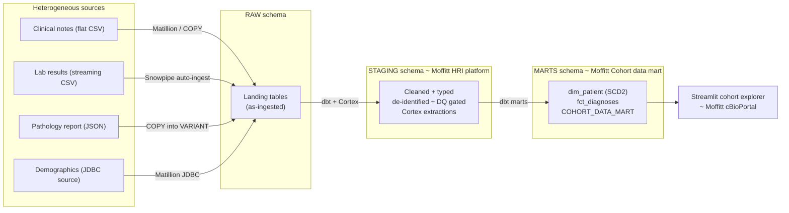

# How OncoLake mirrors Moffitt's published data platform

Moffitt's team published their data platform architecture in *Enabling
Precision Medicine in Cancer Care Through a Molecular Data Warehouse: The
Moffitt Experience* (JCO Clin Cancer Inform, 2021). That paper's Figure 1
shows many heterogeneous sources flowing into governed warehouses, out to a
cohort data mart, and into a cohort explorer (cBioPortal) for researchers.

OncoLake is built on that same engineering shape, at small scale, on fully
synthetic data. It does **not** reproduce their genomic/molecular side; it
applies the same *pattern* (multi-source ingestion, governed warehouse layers,
a cohort mart, an explorer on top) to synthetic clinical data.

## The pattern, side by side

## Component mapping

| Moffitt (paper, Figure 1) | OncoLake equivalent | Where in this repo |
|---|---|---|
| Many clinical + molecular sources | Notes CSV, lab CSV, pathology JSON, JDBC demographics | `data/sample/`, `snowflake/02*.sql`, `matillion/` |
| Loading heterogeneous formats | Matillion ELT + Snowpipe + COPY INTO | `snowflake/02_*.sql`, `04_snowpipe.sql`, `matillion/` |
| HRI clinical data warehouse | Snowflake `STAGING` (cleaned, governed) | `dbt/oncolake/models/staging/` |
| Cohort data mart | `MARTS.COHORT_DATA_MART` | `dbt/oncolake/models/marts/cohort_data_mart.sql` |
| cBioPortal cohort explorer | Streamlit cohort explorer | `streamlit/oncolake_app.py` |
| Data governance / patient policy | HIPAA de-identify + data-quality gate | `src/deidentify.py`, `src/data_quality.py` |
| (Molecular: NSM, ODB, sequencing) | Out of scope. Clinical-notes + Cortex instead. | not built |

## The JD phrases this satisfies

Read the mapping above against the Moffitt Data Engineer I posting:

- "design and implement Snowflake-based data solutions" -> the whole warehouse
- "building infrastructure for optimal extraction, transformation, and loading
  from various data sources" -> Matillion + Snowpipe + COPY
- "ingesting multiple datatypes and source formats (JDBC, API, JSON, flat
  files)" -> the four source types in RAW
- "create or enhance data warehouses/marts" + "data modeling" -> dbt marts,
  SCD2 patient dimension
- "delivers accessible data to power research needs" -> the cohort explorer
- "in accordance with HIPAA and other patient data management policies" ->
  de-identify + data-quality gate

## The honest boundary (say this exactly)

"Same architecture and engineering principles as Moffitt's published clinical
data platform, applied to synthetic data. Different data type (clinical notes
with Cortex, not genomic sequencing), same engineering shape."

Never claim to have rebuilt their system. The most likely eventual reader of
this repo is a co-author of that paper.
